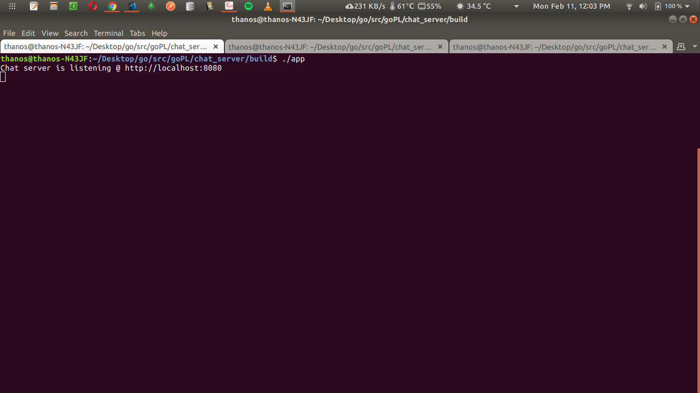
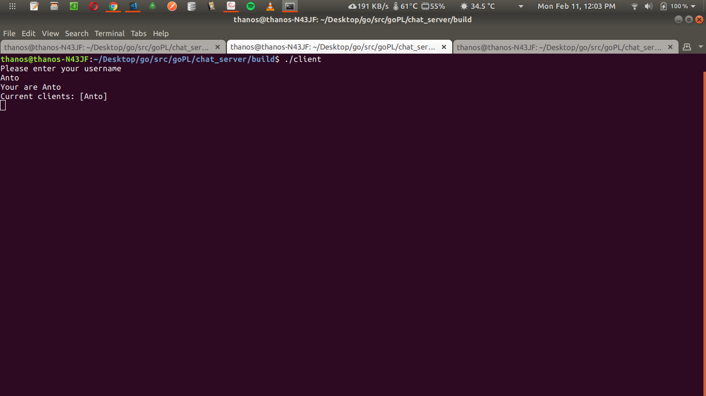
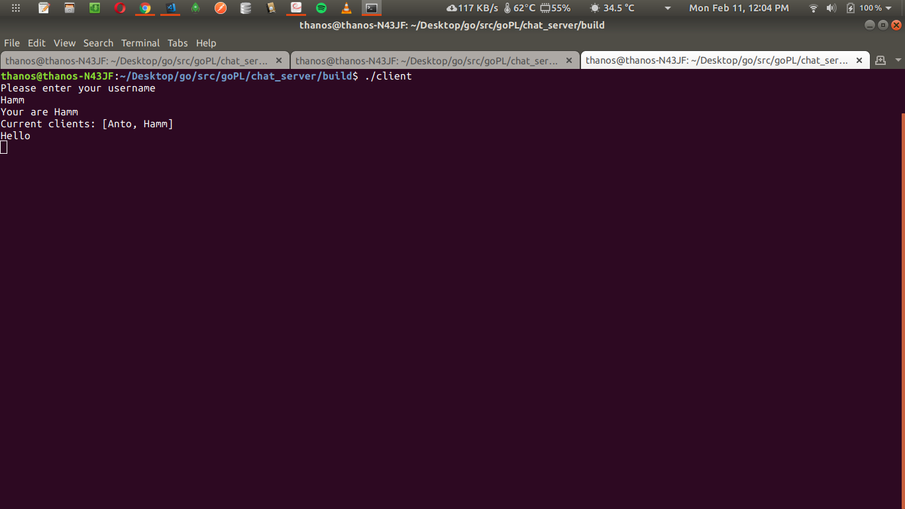
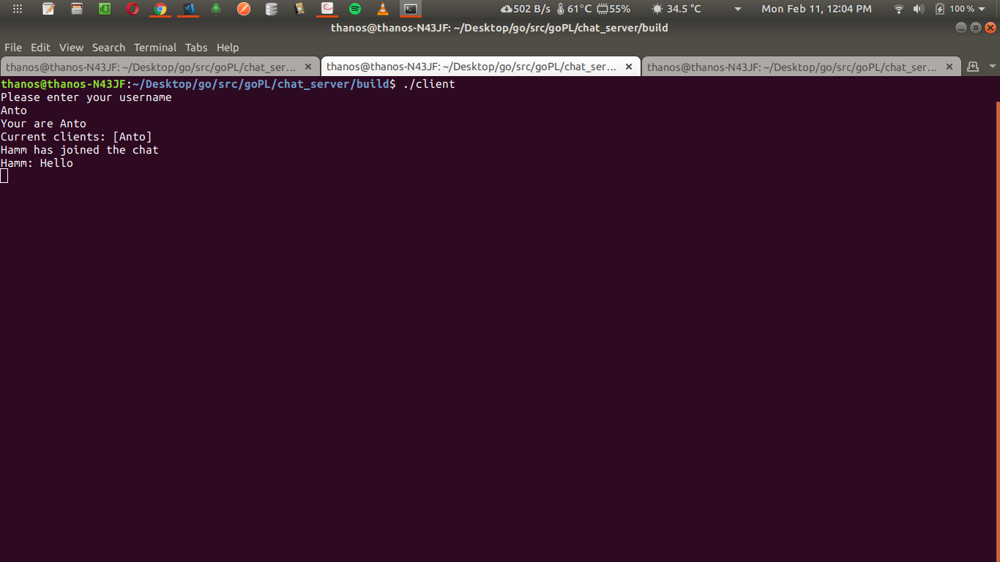
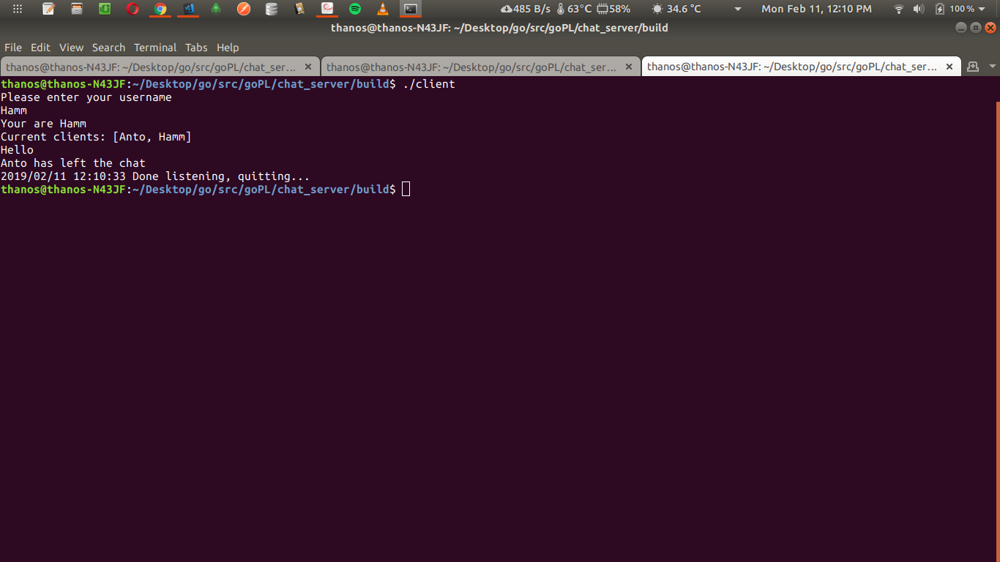

# GOCHATSERVER

IRC-like CLI chat server and client

Features:

- Connect using custom name
- Global chat room
- Auto-disconnect after 5 minutes
- Non-blocking messaging

Screenshots:

- Server start
  
- Client 1 connects
  
- Client 2 connects and sends message
  
- Client 1 receives message
  
- Client 1 disconnects and client 2 receive notification
  
- Server disconnects and client 2 receive notification
  
